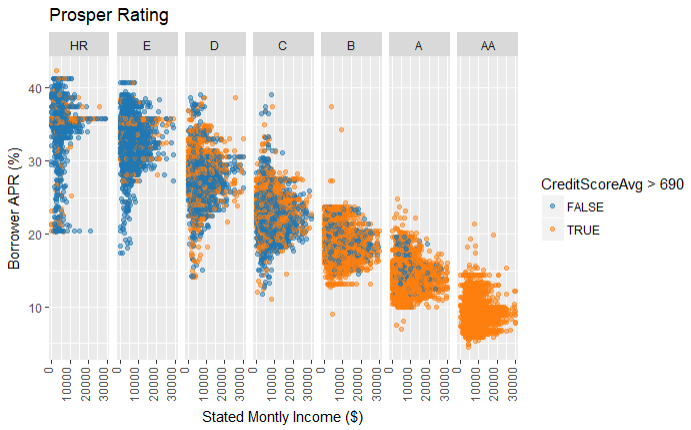

# Exploratory Data Analysis (EDA) with Personal Loan Data

This report explores a dataset provided by [Prosper](https://www.prosper.com) containing loan data for approximately 114,000 loans. The main areas of focus are on how different features such as loan amount, credit grade, and borrower monthly income relate to the APR (annual percentage rate) of a loan. 



## Getting Started

Cloning the git repository and installing [R studio](https://www.rstudio.com/) will help you get a copy of the project up and running on your local machine. The analysis for this project was performed using an R Notebook (.rmd).

```
git clone https://github.com/daniel-codes/prosper-loan-data.git
```

File Description:
* prosperLoanData.csv - Source data for the personal loan data provided by Prosper to Udacity
* prosperLoanData_variableDefinitions.csv - Variable descriptions
* djc_eda_prosper.rmd - R notebook that walks through the analysis and include ggplot2 code

## Authors

- **Daniel Cummings** - [daniel-codes](https://github.com/daniel-codes)

## Acknowledgments

I found these resources particularly helpful for this project: 
https://stackoverflow.com/questions/5208679/order-bars-in-ggplot2-bar-graph
https://stackoverflow.com/questions/4605206/drop-data-frame-columns-by-name
https://stackoverflow.com/questions/10349096/group-data-and-plot-multiple-lines
https://stackoverflow.com/questions/37950511/r-ggplot2-setting-tick-mark-interval 
https://stackoverflow.com/questions/3695497/show-instead-of-counts-in-charts-of-categorical-variables
https://stackoverflow.com/questions/47000494/how-to-add-mean-and-mode-to-ggplot-histogram
http://www.sthda.com/english/wiki/ggplot2-violin-plot-quick-start-guide-r-software-and-data-visualization
http://www.sthda.com/english/wiki/ggplot2-themes-and-background-colors-the-3-elements